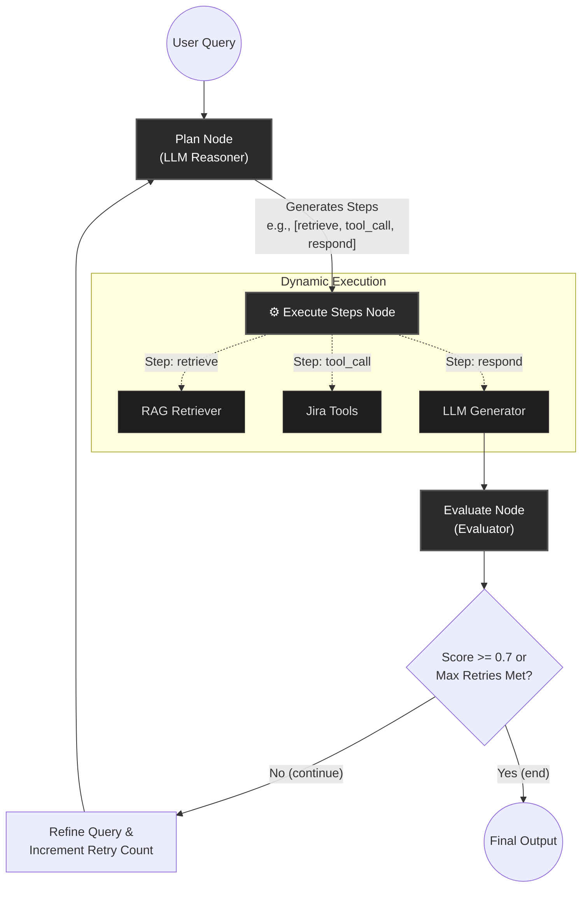

> re-building

```mermaid
graph TD
    A[User Query via Streamlit UI] -->|POST /query| B[FastAPI Endpoint]
    B --> C{LangGraph Orchestrator}
    
    subgraph Agentic Workflow
        C -->|1. Route| D[Plan Node: Reasoning Agent]
        D -->|Steps: retrieve, tool, respond| E[Execute Steps Node]
        E -->|Search| F[(ChromaDB: Local Vector Store)]
        E -->|Tool Call| G[JIRA API Wrapper]
        E -->|Generate| H[Response Generator: HF Model]
        
        H --> I[Evaluate Node: Ragas Metric]
        I -->|Faithfulness & Relevance >= 0.7| J[Final Answer]
        I -->|Score < 0.7| D
    end
    
    J --> B
    F -.->|Ingestion| K[Notion/CSV Data Pipeline]
```

```mermaid
graph TD
    Start((User Query)) --> PlanNode["Plan Node\n(LLM Reasoner)"]
    
    PlanNode --> |"Generates Steps\ne.g., [retrieve, tool_call, respond]"| ExecNode["⚙️ Execute Steps Node"]
    
    subgraph "Dynamic Execution"
        ExecNode -.-> |"Step: retrieve"| Retrieve["RAG Retriever"]
        ExecNode -.-> |"Step: tool_call"| Tools["Jira Tools"]
        ExecNode -.-> |"Step: respond"| Generator["LLM Generator"]
    end
    
    Generator --> EvalNode["Evaluate Node\n(Evaluator)"]
    
    EvalNode --> Condition{"Score >= 0.7 or\nMax Retries Met?"}
    
    Condition -->|"No (continue)"| Refine["Refine Query &\nIncrement Retry Count"]
    Refine --> PlanNode
    
    Condition -->|"Yes (end)"| Final((Final Output))

    classDef main fill:#2b2b2b,stroke:#555,stroke-width:2px,color:#fff
    classDef sub fill:#1e1e1e,stroke:#333,stroke-width:1px,color:#ddd
    class PlanNode,ExecNode,EvalNode main
    class Retrieve,Tools,Generator sub
```