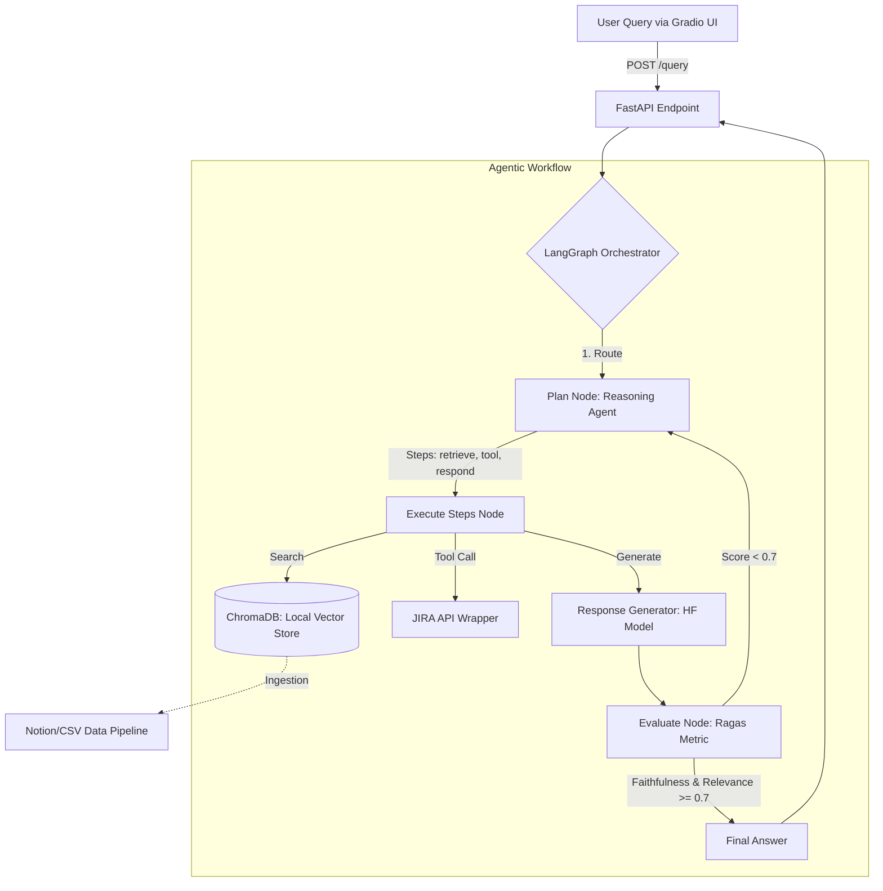

> [THINKING BLOG](https://4t-audio.vercel.app/blog/agentic-crm-support)

```mermaid
graph TD
    A[User Query via Gradio UI] -->|POST /query| B[FastAPI Endpoint]
    B --> C{LangGraph Orchestrator}
    
    subgraph Agentic Workflow
        C -->|1. Route| D[Plan Node: Reasoning Agent]
        D -->|Steps: retrieve, tool, respond| E[Execute Steps Node]
        E -->|Search| F[(ChromaDB: Local Vector Store)]
        E -->|Tool Call| G[JIRA API Wrapper]
        E -->|Generate| H[Response Generator: HF Model]
        
        H --> I[Evaluate Node: Ragas Metric]
        I -->|Faithfulness & Relevance >= 0.7| J[Final Answer]
        I -->|Score < 0.7| D
    end
    
    J --> B
    F -.->|Ingestion| K[Notion/CSV Data Pipeline]
```