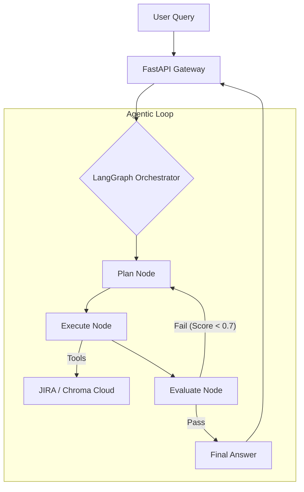

# Autonomous Agentic Workflow: Integrating RAG, LangGraph, and JIRA

> [THINKING BLOG](https://4t-audio.vercel.app/blog/agentic-crm-support)

CRM support tickets are messy. They reference past interactions, account state, and product details. A single ticket might need a knowledge base lookup, a JIRA action, and a coherent response in sequence. 

## 🏛️ Architecture: The Stateful Loop
The system uses a **Decoupled Node-Graph Architecture**. By separating the **Topology** (the map) from the **Node Logic** (the muscles), I achieved a modular codebase that is highly maintainable and production-ready.

### 1. Autonomous Planning & Heuristics
Instead of hardcoding a sequence, the **Reasoner** generates a dynamic JSON plan. I implemented a **Heuristic Layer** to ensure that mission-critical actions (like JIRA ticket creation) are always prioritized, regardless of LLM variance.

### 2. Cloud-Native RAG (Zero-Footprint)
To make the system truly lightweight, I moved away from local embedding models. We now use **ChromaDB Cloud** and the **HuggingFace Inference API**. This offloads the heavy math to the cloud, reducing the container footprint by **90% (from 5GB to 400MB)**.

### 3. Agentic Self-Critique
I implemented a **Custom Agentic Self-Critique** node. The AI evaluates its own response for **Faithfulness** (hallucination check) and **Relevance**. If the score is low, the LangGraph state machine triggers a **Refinement Cycle**.

### 4. Enterprise Observability
The system is tightly integrated with **LangSmith**. Every reasoning step, tool call, and self-critique is traced in real-time, providing granular visibility into the agent's "Chain of Thought."

## 🛠️ The Tech Stack
*   **Orchestration**: LangGraph (Stateful cycles)
*   **Brain**: Qwen-2.5-1.5B (Inference API)
*   **Memory**: ChromaDB Cloud (Vector Storage)
*   **Actions**: JIRA API (Atlassian Document Format)
*   **Observability**: LangSmith (Full-stack tracing)
*   **Infrastructure**: Docker (Multi-stage Slim)