# Agentic CRM Support

> [THINKING BLOG (old)](https://4t-audio.vercel.app/blog/agentic-crm-support)

<video src="https://github.com/iam4tart/agentic-crm-support/raw/main/video/agentic.mp4" controls="controls" width="100%">
  <source src="video/agentic.mp4" type="video/mp4">
  Your browser does not support the video tag.
</video>

> [Working Demo]([https://4t-audio.vercel.app/blog/agentic-crm-support](https://github.com/iam4tart/agentic-crm-support/raw/main/video/agentic.mp4))




## Quick Start

```bash
# Install dependencies
pip install -r requirements.txt

# Start backend (with WebSocket support)
python -m uvicorn api.main:app --host 0.0.0.0 --port 8000 --ws websockets

# Start Gradio UI
python ui/app.py
```

```bash
# Docker
docker-compose up
```

## API Endpoints

| Method | Endpoint | Description |
|---|---|---|
| GET | `/` | Health check |
| GET | `/health/mcp` | MCP server health report |
| POST | `/query` | Sync query (normal mode) |
| WS | `/ws/{session_id}` | WebSocket streaming |
| GET | `/stream/{session_id}` | SSE fallback stream |
| POST | `/webhook/jira` | Inbound Jira webhook |

## Test Webhook

```bash
curl -X POST http://localhost:8000/webhook/jira \
  -H "Content-Type: application/json" \
  -d '{"webhookEvent": "jira:issue_updated", "issue": {"key": "KAN-1"}, "changelog": {"items": [{"field": "status", "toString": "In Progress"}]}}'
```
